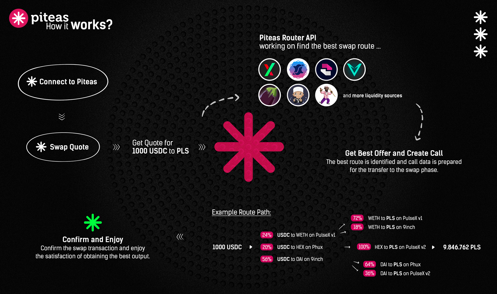

# 💠 Overview

<figure><figcaption></figcaption></figure>

First Optimal & Productive Dex Aggregator on Pulsechain.

Piteas serves as a dex aggregator that leverages the latest in swap technology. By integrating multiple DEXs, our platform provides users with access to the vast pools of the most widely used DeFi protocols, amounting to billions of dollars in liquidity. With our advanced routing algorithm, Piteas ensures the best price, lowest slippage, and highest returns for each transaction.

Leveraging our advanced routing algorithm, Piteas ensures optimal pricing, minimal slippage, and maximized returns for every transaction.

<figure><figcaption></figcaption></figure>

Let's take a closer look at how Piteas operates:

1. User Request: A user wishing to make a trade submits a request to the Piteas platform for a specific token pair swap.
2. DEX Pools: Piteas scans and analyzes the liquidity available across the integrated DEX pools. Each DEX pool represents a different DeFi protocol where users can execute trades.
3. Optimal Routing: Using its advanced routing algorithm, Piteas determines the best swap route to fulfill the user's request. The algorithm intelligently routes the trade through the liquidity pools to achieve the best price, lowest slippage, and highest returns for the user.
4. Swap Execution: Based on the determined optimal swap route, Piteas executes the user's trade across multiple DEX pools. During this process, the user's specific token is swapped for the desired token.
5. Result and Confirmation: Piteas informs the user about the outcome of the completed swap transaction. The user receives the necessary confirmation to verify that the desired swap has been executed successfully.

The primary objective of Piteas is to enable users to access multiple DEXs from a single platform, maximizing liquidity utilization. Through Piteas, users can automatically identify the best swap routes, resulting in better prices, low slippage, and higher returns.

By facilitating efficient navigation among various protocols in the DeFi landscape, Piteas optimizes liquidity while delivering an enhanced trading experience for users.

> **Build for Pulsechain & HEX community.**

**Easy Links:**

* Website: [piteas.io](https://piteas.io/)
* Twitter: [https://twitter.com/piteasio](https://twitter.com/piteasio)
* Telegram: [https://t.me/piteasio](https://t.me/piteasio)
* Launch App: [https://app.piteas.io](https://app.piteas.io)
* Github: [https://github.com/piteasio](https://github.com/piteasio)
