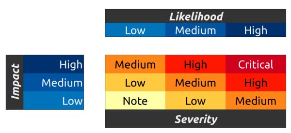

# 🐛 Bug Bounty

### Bounty Program 

We encourage the community to audit our open source code; we also encourage the responsible disclosure of any issues. The bug bounty program is intended to recognize the value of working with the community of independent security researchers and sets out our definition of good faith in the context of finding and reporting vulnerabilities, as well as what you can expect from us in return.

Piteas offers substantial rewards for discoveries that can prevent the loss of assets, the freezing of assets, or harm to users.

To be eligible a bounty, a bug must have not been previously known by the Piteas team or publicly disclosed by anyone. All Piteas smart contracts and interactions (including bots and front end code) are in scope.

The amount of compensation will vary depending on bug severity. Reward amounts typically correspond to severity in the following manner. The reward currency can be discussed on a case by case basis.

| Severity |               Reward |
| -------- | -------------------: |
| Low      |                 $250 |
| Medium   |               $1,000 |
| High     |              $10,000 |
| Critical | 10% of funds at risk |

Severity is calculated according to the [OWASP](https://owasp.org/www-project-risk-assessment-framework/) risk rating model based on Impact and Likelihood.

<figure><figcaption></figcaption></figure>

### Submissions 

Please email your submissions to bugs@piteas.io.

The submission must include clear and concise steps to reproduce the discovered vulnerability. The following layout of the bug bounty report is encouraged:

* Description: Describe at a high level the bug with links to problematic code
* Attack: Detailed instructions for exploiting the bug
* Mitigation: How to resolve the bug
* Suggested risk rating: The recommended severity of this bug
