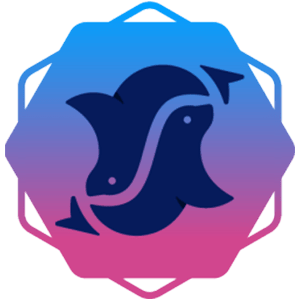

# 🧩 Protocols

Piteas is a dex aggregator on Pulsechain, with integrated AMM protocols.

#### The active protocols are:

*  PulseX ([https://pulsex.com](https://pulsex.com)) - V1 and V2 pools
*  Hedron ([https://hedron.pro](https://hedron.pro/#/)) - Uniswap V2 and V3 pools
*  Phux.io ([https://phux.io](https://phux.io)) - Stable and Weighted Pools
*  Velocimeter ([https://pulse.velocimeter.xyz](https://pulse.velocimeter.xyz)) - vAMM and sAMM pools

#### The incoming protocols to be integrated are:

*  9inch ([https://www.9inch.io](https://www.9inch.io))
*  Phamous.io ([https://phamous.io](https://phamous.io))
*  Makiswap ([https://makiswap.com](https://makiswap.com))

These protocols are part of Piteas' integration, offering users a diverse range of liquidity and enhanced trading opportunities.
