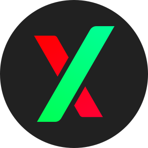
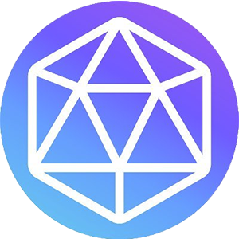
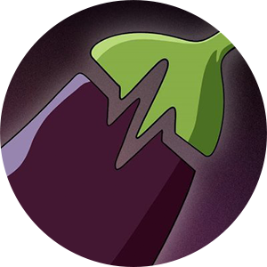

# 🧩 Protocols

### Piteas is a dex aggregator on Pulsechain.

There is integrated AMM protocols to Pulsechain Dex Aggregator:

*  PulseX ([https://pulsex.com](https://pulsex.com))
*  Hedron ([https://hedron.pro](https://hedron.pro/#/))
*  9inch ([https://www.9inch.io](https://www.9inch.io))
*  BunnySwap ([https://bunnyswap.xyz](https://bunnyswap.xyz))
