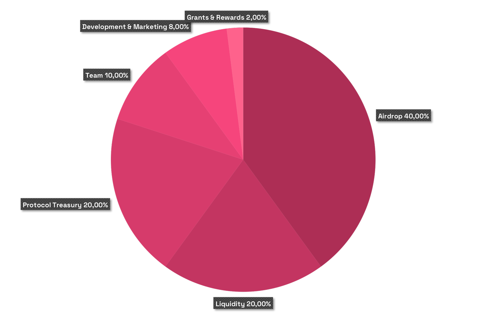

# 🪙 Tokenomics


Piteas has no any governance or utility tokens yet! Please beware of scammers.

**This content is currently in draft mode and being updated.**


### **PTS Token**

PTS Token is the utility token of Piteas and represents voting rights in the upcoming governance model. It has an organic connection with the Piteas protocol and its revenue model, making it essential for the protocol's sustainable economy.

#### **Key Characteristics:**

* Fixed supply: The token has a fixed supply and cannot be minted, only burned.
* Deflationary model: The token's supply will continuously decrease based on the protocol's revenue.
* Fundamental for upcoming features: PTS Token serves as a cornerstone for various features that will be launched in the future, including Gasless trade, swap fee reduce, etc.

### **Tokenomics Detail:**

<table data-header-hidden data-full-width="true"><thead><tr><th width="259"></th><th width="151" align="center"></th><th width="162" align="center"></th><th width="435"></th></tr></thead><tbody><tr><td>Airdrop</td><td align="center">40%</td><td align="center">40,000,000</td><td>100% unlock at TGE (?)</td></tr><tr><td>Liquidity</td><td align="center">20%</td><td align="center">20,000,000</td><td>100% unlock at TGE (?)</td></tr><tr><td>Protocol Treasury</td><td align="center">20%</td><td align="center">20,000,000</td><td>Locked (Piteas Governance)</td></tr><tr><td>Team</td><td align="center">10%</td><td align="center">10,000,000</td><td>10% at TGE, then linear vesting for 10 months</td></tr><tr><td>Development &#x26; Marketing</td><td align="center">8%</td><td align="center">8,000,000</td><td>10% at TGE, then linear vesting for 10 months</td></tr><tr><td>Grants &#x26; Rewards</td><td align="center">2%</td><td align="center">2,000,000</td><td>10% at TGE, then linear vesting for 10 months</td></tr></tbody></table>

<figure><figcaption>
Tokenomics - Share
</figcaption></figure>

