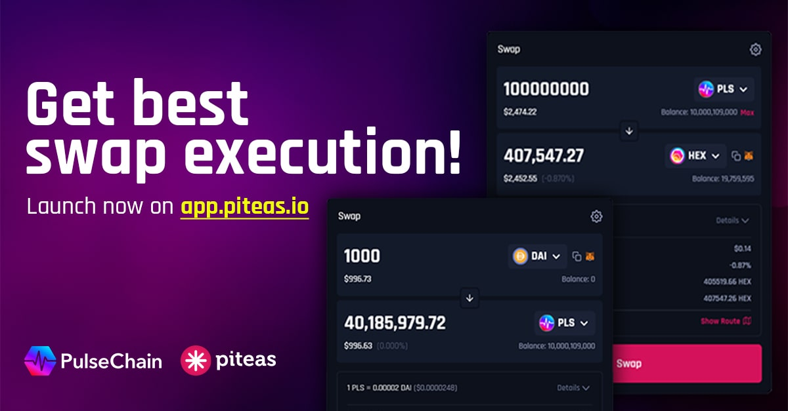
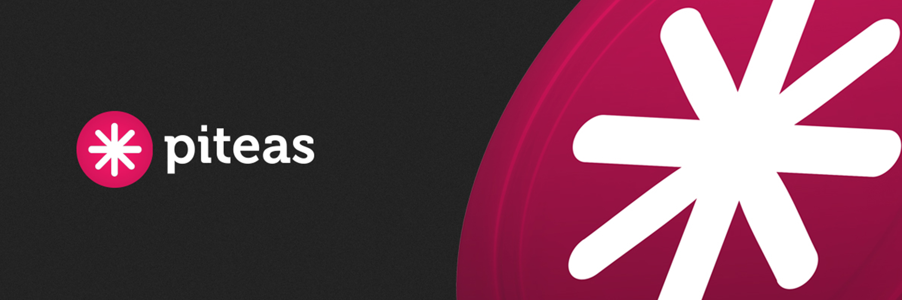
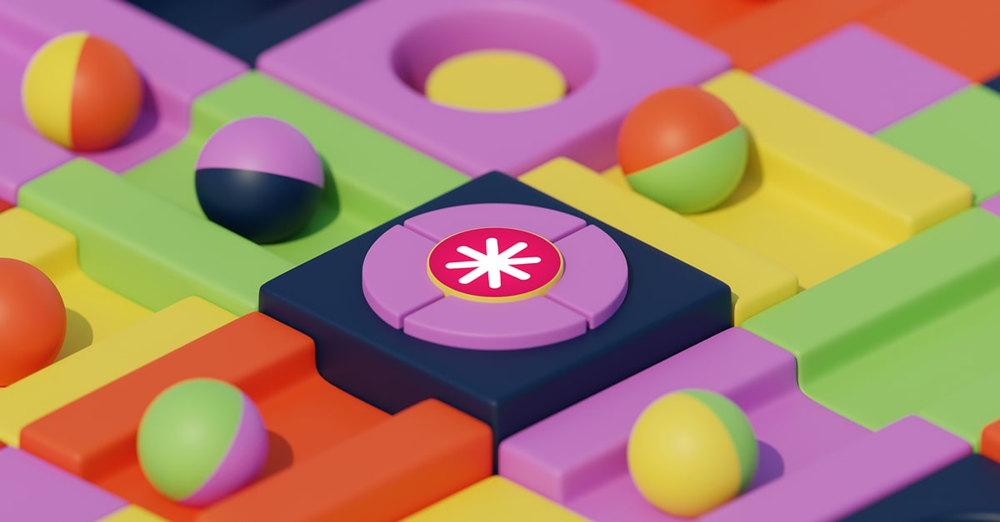
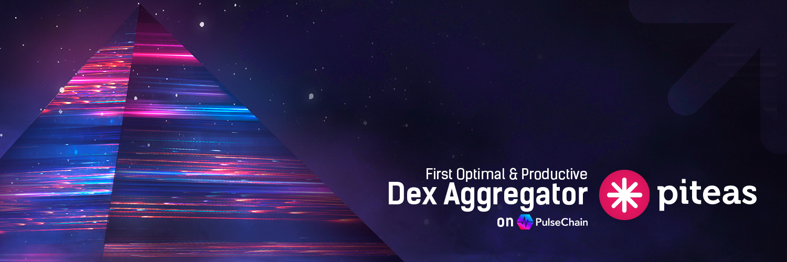
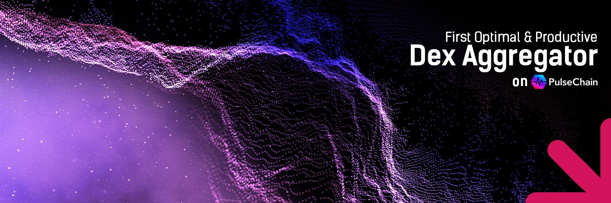

# 🌉 Branding Sources

#### Branding Pack - Piteas

<figure><figcaption>
Icon - Original
</figcaption></figure> <figure><figcaption></figcaption></figure>

<figure><picture><source srcset="../.gitbook/assets/piteas-logo-wide-w.png" media="(prefers-color-scheme: dark)"></picture><figcaption>
Logo - Original
</figcaption></figure> <figure><picture><source srcset="../.gitbook/assets/piteas-logo-wide.png" media="(prefers-color-scheme: dark)"></picture><figcaption>
Logo - TextWhite "darkmode"
</figcaption></figure>


Piteas - Logo Pack


#### Assets - Piteas

<figure><figcaption></figcaption></figure>

<figure><figcaption></figcaption></figure>

<figure><figcaption></figcaption></figure>

<figure><figcaption></figcaption></figure>

<figure><figcaption></figcaption></figure>

<figure><figcaption></figcaption></figure>
