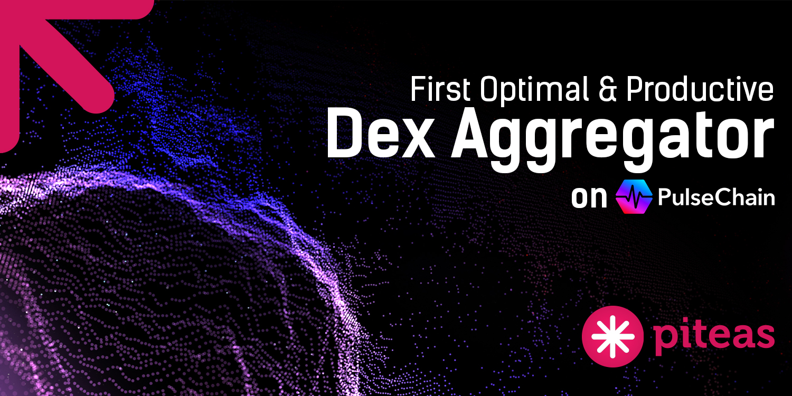
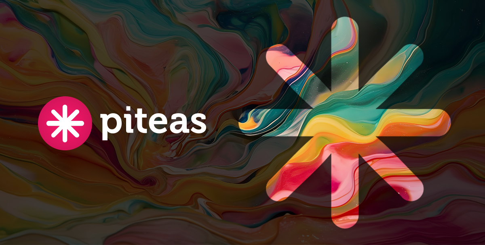
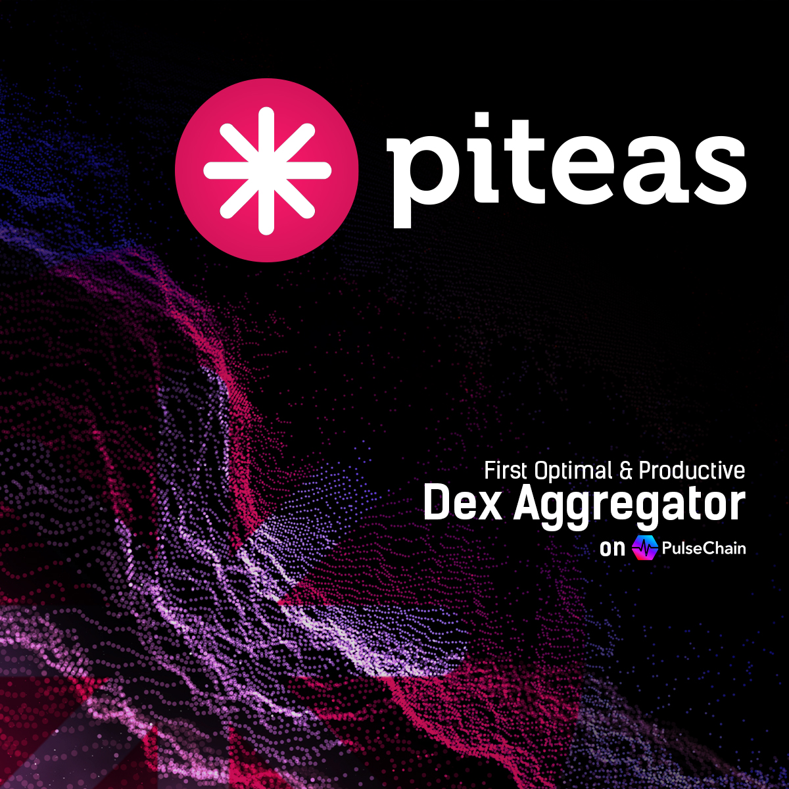

# 🌉 Branding Sources

#### Branding Pack - Piteas

<figure><figcaption></figcaption></figure>


Piteas - Logo Pack


#### Assets - Piteas

<figure><figcaption></figcaption></figure>

<figure><figcaption></figcaption></figure>

<figure><figcaption></figcaption></figure>

<figure><figcaption></figcaption></figure>

<figure><figcaption></figcaption></figure>

<figure><figcaption></figcaption></figure>
